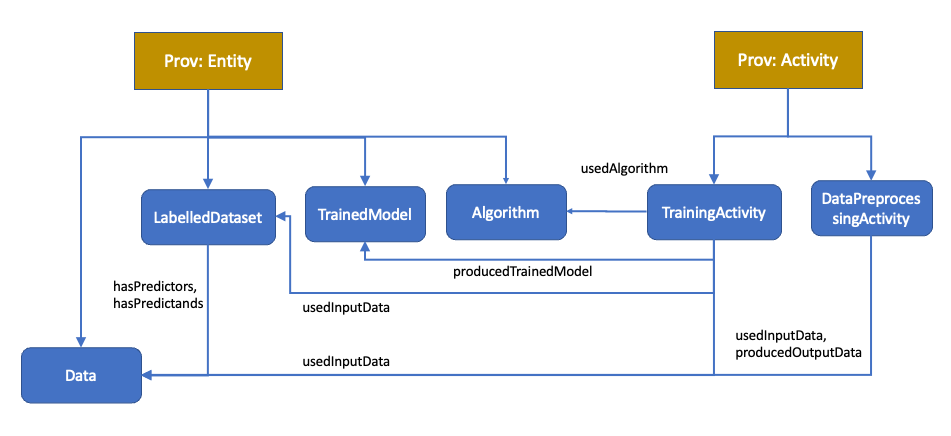

# Provenance for Machine Learning Models (PMLM)

We use the W3C PROV standard as a basis [CITE], in particular the PROV-O ontology which we extend for ML models. PROV represents resources (entities), actions (activities), and actors (agents).  PROV also represents their relationships: an entity was used by an activity, a new entity was generated by an activity, an agent was associated with an activity, and so on.  We use the prefix prov: for the PROV namespace and terms, and pmlm: for the PMLM namespace and terms, pmlm-d: for PMLM Data namespace and terms, pmlm-a: for PMLM Algorithms namespace and terms.

We have created PMLM, which includes:
* PROV entities to represent the data, algorithms, and metrics:
	* The training and testing process used to generate a model
	* The data used to train and test the model, 
	* The metrics used to evaluate and choose the best model
* PROV activities to represent executed steps during training:
	* Executions of ML algorithms
	* Executions of data pre-processing steps

The ontology is divided into 3 parts:
* **PMLM Provenance Ontology:**
	* [https://w3id.org/pmlm/mlprov](https://w3id.org/pmlm/mlprov)
* **PMLM Algorithms Ontology:**
	* [https://w3id.org/pmlm/algorithms](https://w3id.org/pmlm/mlprov)
* **PMLM Data Ontology:**
	* [https://w3id.org/pmlm/data](https://w3id.org/pmlm/mlprov)

Here is an overview of hte top level classes and properties in PMLM:

